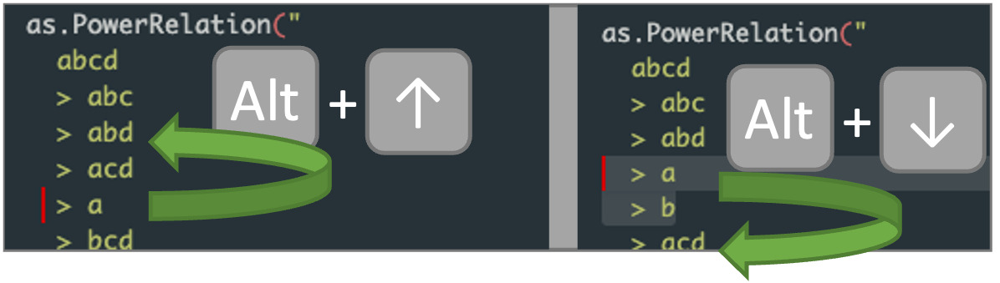

```{r echo=FALSE}
# setup for tex documents
# remove ## in front of output
# adjust spacing before and after code chunks
if(knitr::is_latex_output()) {
  hook_output <- knitr::knit_hooks$get("output")
  hook_warning <- knitr::knit_hooks$get("warning")
  
  # remove ##, wrap long output lines
  knitr::knit_hooks$set(output = function(x, options) {
    x <- knitr:::split_lines(x)
    # x <- gsub("^## ", "#| ", x)
    if (any(nchar(x) > 70)) x <- strwrap(x, width = 70)
    x <- paste(x, collapse = "\n")
    hook_output(x, options)
    
  }, warning = function(x, options) {
    x <- knitr:::split_lines(x)
    x <- gsub("^## ", "#! ", x)
    if (any(nchar(x) > 70)) x <- strwrap(x, width = 70)
    x <- paste(x, collapse = "\n")
    hook_warning(x, options)
  })
  
  # adjust spacing around code chunks
  oldSource <- knitr::knit_hooks$get("source")
  knitr::knit_hooks$set(source = function(x, options) {
    x <- oldSource(x, options)
  
    if(options$echo == FALSE)
      return(x)
  
    paste0(
      '\\vspace{10pt}',
      x,
      '\n\\vspace{-10pt}'
    )
  })
}

examples <- list()
exampleCounter <- function(id) {
  if(missing(id)) {
    examples[[length(examples) + 1]] <- -1
  
  } else if(id %in% names(examples)) {
    stop(paste("id", id, "is already in examples"))
  } else {
    examples[[id]] <<- length(examples) + 1
  }
  return(length(examples))
}

definitions <- list()
definitionCounter <- function(id) {
  if(missing(id)) {
    definitions[[length(definitions)+1]] <<- length(definitions) + 1
    
  } else if(id %in% names(examples)) {
    stop(paste("id", id, "is already in examples"))
  } else {
    definitions[[id]] <<- length(definitions) + 1
  }
  length(definitions)
}

refId <- function(id, htmlTemplate = "[ID](ID)") {
  if(knitr::is_latex_output())
    paste0("\\ref{", id, "}")
  else
    gsub("ID", paste0("#", id), htmlTemplate)
}

refDef <- function(def) {
  if(!(def %in% names(definitions)))
    stop(paste0("Definition ", def, " is not defined"))
  
  if(knitr::is_latex_output())
    paste0("\\ref{", def, "}")
  else
    paste0("[", definitions[[def]], "](#", def, ")")
}
```

\newcommand{\rel}[1]{R^\succsim_\textrm{#1}}
\newcommand{\score}[1]{\text{Score}_\text{#1}}

<!--
# ```{r eval=TRUE, echo=FALSE}
# child_docs <- list.files(path="chapters",recursive = TRUE, pattern=".Rmd", full.names = TRUE)
# ```
# 
# 
# 
# ```{r, child = child_docs}
-->

# Introduction

In the literature of cooperative games, the notion of *power index* [@shapley1954method; @1964Banzhaf; @holler2013power] has been widely studied to analyze the "influence" of individuals   taking into account  their ability   to force a decision within groups or coalitions. In practical situations, however, the information concerning the strength of coalitions  is hardly quantifiable. So, any attempt to numerically represent  the influence of groups and individuals clashes with the complex and multi-attribute nature of the problem and it seems more realistic to represent collective decision-making mechanisms using an ordinal coalitional framework based on two main ingredients: a binary relation over groups or coalitions and a ranking over the individuals.

The main objective of the package `socialranking` is to provide answers for  the general problem of how to compare the elements of a finite set $N$ given a ranking over the elements of its power-set (the set of all possible subsets of $N$). To do this, the package `socialranking` implements a portfolio of solutions from the recent literature on *social rankings* [@2017axiomaticAndAlgorithmicPerspectives; @2019OrdinalBanzhaf; @2018CPMajority; @2018CPMajoritySims; @2019PreferenceRelation; @2021Lexcel; @2021Manipulability; @beal2022lexicographic].

## Quick start

A *power relation* (i.e, a ranking over subsets of a finite set $N$; see the Section `r refId("sec:prelim", "on [PowerRelation objects](ID)")` for a formal definition) can be constructed using the functions `PowerRelation()` or `as.PowerRelation()`.

```{r}
library(socialranking)
PowerRelation(list(list(c(1,2)), list(1, c()), list(2)))

as.PowerRelation("12 > 1 ~ {} > 2")

as.PowerRelation("ab > a ~ {} > b")

as.PowerRelation(list(c(1,2), 1, c(), 2))

as.PowerRelation(list(c(1,2), 1, c(), 2), comparators = c(">", "~", ">"))
```

Functions used to analyze a given `PowerRelation` object can be grouped into three main categories:

* *Comparison* functions, only comparing two elements;
* *Score* functions, calculating the scores for each element;
* *Ranking* functions, creating `SocialRanking` objects.

Comparison and score functions are often used to evaluate a social ranking solution (see section `r refId("sec:prelim", "on [PowerRelation objects](ID)")` for a formal definition). Listed below are some of the most prominent functions and solutions introduced in the aforementioned papers.

````{=html}
```{r, echo=FALSE, results='asis'}
xfun::file_string("tables/functionTable.html")
```
````


These functions may be called as follows.

```{r}
pr <- as.PowerRelation("ab > abc ~ ac ~ bc > a ~ c > {} > b")

# a dominates b, but b does not dominate a
c(dominates(pr, "a", "b"),
  dominates(pr, "b", "a"))

# calculate cumulative scores
scores <- cumulativeScores(pr)
# show score of element a
scores$a

# performing a bunch of rankings
lexcelRanking(pr)
L1Ranking(pr)
dualLexcelRanking(pr)
copelandRanking(pr)
kramerSimpsonRanking(pr)
ordinalBanzhafRanking(pr)
```

Lastly, an incidence matrix for all given coalitions can be constructed using `powerRelationMatrix(pr)` or `as.relation(pr)` from the `relations` package [@relationsPackage]. The incidence matrix may be displayed using `relations::relation_incidence()`.

```{r}
rel <- relations::as.relation(pr)
rel

relations::relation_incidence(rel)
```

# `PowerRelation` objects{#sec:prelim}

We first introduce some basic definitions on binary relations. Let $X$ be a set. A set $R \subseteq X \times X$ is said a *binary relation* on $X$.
For two elements $x, y \in X$, $xRy$ refers to their relation, more formally it means that $(x,y) \in R$. A binary relation $(x,y) \in R$ is said to be

* *reflexive*, if for each $x \in X, xRx$,
* *transitive*, if for each $x, y, z \in X, xRy$ and $yRz \Rightarrow xRz$,
* *total*, if for each $x,y \in X, x \neq y \Rightarrow xRy$ or $yRx$,
* *symmetric*, if for each $x,y \in X,xRy \Leftrightarrow yRx$,
* *asymmetric*, if for each $x,y \in X,(x,y) \in R \Rightarrow (y,x) \notin R$, and
* *antisymmetric*, if for each $x,y \in X,xRy \cap yRx \Rightarrow x=y$.


A *preorder* is defined as a reflexive and transitive relation. If it is total, it is called a *total preorder*. Additionally if it is antisymmetric, it is called a *linear order*.

Let $N = \{1, 2, \dots, n\}$ be a finite set of *elements*, sometimes also called *players*. For some $p \in \{1, \ldots, 2^n\}$, let $\mathcal{P} = \{S_1, S_2, \dots, S_{p}\}$ be a set of *coalitions* such that $S_i \subseteq N$ for all $i \in \{1, \ldots, p\}$.  Thus $\mathcal{P} \subseteq 2^N$, where $2^N$ denotes the power set of $N$, the set of all subsets or coalitions of $N$.

$\mathcal{T}(N)$ denotes the set of all total preorders on $N$, $\mathcal{T}(\mathcal{P})$ the set of all total preorders on $\mathcal{P}$. A single total preorder $\succsim \in \mathcal{T}(\mathcal{P})$ is said a *power relation*.

In a given power relation $\succsim \in \mathcal{T}(\mathcal{P})$ on $\mathcal{P} \subseteq 2^N$, its symmetric part is denoted by $\sim$ (i.e., $S \sim T$ if $S \succsim T$ and $T \succsim S$), whereas its asymmetric part is denoted by $\succ$ (i.e., $S \succ T$ if $S \succsim T$ and not $T \succsim S$). In other terms, for $S \sim T$ we say that $S$ is *indifferent* to $T$, whereas for $S \succ T$ we say that $S$ is *strictly better* than $T$.

Lastly, for a given power relation in the form of $S_1 \succsim S_2 \succsim \ldots \succsim S_m$, coalitions that are indifferent to one another can be grouped into *equivalence classes* $\sum_i$ such that we get the *quotient order* $\sum_1 \succ \sum_2 \succ \ldots \succ \sum_m$.

:::{.example data-latex="" .theorem text="`r exampleCounter("ex:1")`" #ex:1}
\label{ex:1}
Let $N=\{1,2\}$ be two players with its corresponding power set $2^N = \{\{1,2\}, \{1\}, \{2\}, \emptyset\}$. The following power relation is given:

$$
\begin{array}{rrrr}
\succsim \ =\ \{(\{1,2\},\{1,2\}), & (\{1,2\},\{2\}), & (\{1,2\},\emptyset), & (\{1,2\},\{1\}),\hphantom{\}}\\
& (\{2\}, \{2\}), & (\{2\}, \emptyset), & \hphantom{1,}(\{2\}, \{1\}),\hphantom{\}}\\
& (\emptyset, \emptyset), & (\emptyset, \{2\}), & (\emptyset, \{1\}),\hphantom{\}}\\
& & & (\{1\}, \{1\})\hphantom{,}\}
\end{array}
$$

This power relation can be rewritten in a consecutive order as: $\{1,2\} \succ \{2\} \sim \emptyset \succ \{1\}$. Its quotient order is formed by three equivalence classes $\sum_1 = \{\{1,2\}\}, \sum_2 = \{\{2\}, \emptyset\},$ and $\sum_3 = \{\{1\}\}$; so the quotient order of $\succsim$ is such that $\{\{1,2\}\} \succ \{\{2\}, \emptyset\} \succ \{\{1\}\}$.
:::

Note that the way the set $\succsim$ is presented in the example is somewhat deliberate to better visualize occurring symmetries and asymmetries. This also lets us neatly represent a power relation in the form of an `r if(knitr::is_latex_output()) "incidence matrix in chapter"` `r refId("relations", "[incidence matrix](ID)")`.

## Creating `PowerRelation` objects

A power relation in the `socialranking` package is defined to be reflexive, transitive and total. In designing the package it was deemed logical to have the coalitions specified in a consecutive order, as seen in Example `r refId("ex:1", paste0("[", examples[["ex:1"]], "](ID)"))`. Each coalition in that order is split either by a `">"` (left side strictly better) or a `"~"` (two coalitions indifferent to one another). The following code chunk shows the power relation from Example `r refId("ex:1", paste0("[", examples[["ex:1"]], "](ID)"))` and how a correlating `PowerRelation` object can be constructed.

```{r}
library(socialranking)
pr <- PowerRelation(list(
  list(c(1,2)),
  list(2, c()),
  list(1)
))
pr

class(pr)
```

Notice how coalitions such as $\{1,2\}$ are written as `12` to improve readability. Similarly, passing a string to the function `as.PowerRelation()` saves some typing on the user's end by interpreting each character of a coalition as a separate element. Note that spaces in that function are ignored.

```{r}
as.PowerRelation("12 > 2~{} > 1")
```

The compact notation is only done in `PowerRelation` objects where every element is one digit or one character long. If this is not the case, curly braces and commas are added where needed.

```{r}
prLong <- PowerRelation(list(
  list(c("Alice", "Bob")), 
  list("Bob", c()),
  list("Alice")
))
prLong

class(prLong)
```

Some may have spotted a `"SingleCharElements"` class missing in `class(prLong)` that has been there in `class(pr)`. `"SingleCharElements"` influences how coalitions are printed. If it is removed from `class(pr)`, the output will include the same curly braces and commas displayed in `prLong`.

```{r}
class(pr) <- class(pr)[-which(class(pr) == "SingleCharElements")]
pr
```

Internally a `PowerRelation` is a list with four attributes.


````{=html}
```{r, echo=FALSE, results='asis'}
xfun::file_string('tables/prObject.html')
```
````

While coalitions are formally defined as sets, meaning the order doesn't matter and each element is unique, the package tries to stay flexible.
As such, coalitions will only be sorted during initialization, but duplicate elements will not be removed.

```{r}
prAtts <- PowerRelation(list(
  list(c(2,2,1,1,2)),
  list(c(2,1), c())
))
prAtts

prAtts$elements

prAtts$coalitionLookup(c(1,2))
prAtts$coalitionLookup(c(2,1))
prAtts$coalitionLookup(c(2,1,2,1,2))

prAtts$elementLookup(2)
```

## Manipulating `PowerRelation` objects

It is strongly discouraged to directly manipulate `PowerRelation` objects, as its attributes are so tightly coupled.
This would require updates in multiple places.
Instead, it is advisable to simply create new `PowerRelation` objects.

To permutate the order of equivalence classes, it is possible to take the equivalence classes in `$eqs` and use a vector of indexes to move them around.

```{r}
pr <- as.PowerRelation("12 > (1 ~ {}) > 2")
PowerRelation(pr$eqs[c(2, 3, 1)])

PowerRelation(rev(pr$eqs))
```

For permutating individual coalitions, using `as.PowerRelation.list()` may be more convenient since it doesn't require nested list indexing.

```{r}
coalitions <- unlist(pr$eqs, recursive = FALSE)
compares <- c(">", "~", ">")
as.PowerRelation(coalitions[c(2,1,3,4)], comparators = compares)

# notice that the length of comparators does not need to match
# length(coalitions)-1
as.PowerRelation(rev(coalitions), comparators = c("~", ">"))

# not setting the comparators parameter turns it into a linear order
as.PowerRelation(coalitions)
```

### `appendMissingCoalitions()`

Let $\succsim \in \mathcal{T}(\mathcal{P})$. We may have not included all possible coalitions, such that $\mathcal{P} \subset 2^N, \mathcal{P} \neq 2^N$.

`appendMissingCoalitions()` appends all the missing coalitions $2^N - \mathcal{P}$ as a single equivalence class to the end of the power relation.

```{r}
pr <- PowerRelation(list(
  list(c("AT", "DE"), "FR"),
  list("DE"),
  list(c("AT", "FR"), "AT")
))
pr

# since we have 3 elements, the super set 2^N should include 8 coalitions
appendMissingCoalitions(pr)
```

### `makePowerRelationMonotonic()`

A power relation $\succsim \in \mathcal{T}(\mathcal{P})$ is monotonic if

$$
S \succsim T \quad \Rightarrow \quad T \subset S
$$

for all $S, T \subseteq N$.
In other terms, given a monotonic power relation, for any coalition, all its subsets cannot be ranked higher.

`makePowerRelationMonotonic()` turns a potentially non-monotonic power relation into a monotonic one by moving and (optionally) adding all missing coalitions in $2^N - \mathcal{P}$ to the corresponding equivalence classes.

```{r}
pr <- as.PowerRelation("a > b > c ~ ac > abc")
makePowerRelationMonotonic(pr)

makePowerRelationMonotonic(pr, addMissingCoalitions = FALSE)

# notice how an empty coalition in some equivalence class
# causes all remaining coalitions to be moved there
makePowerRelationMonotonic(as.PowerRelation("ab > c > {} > abc > a > b"))
```


## Creating power sets

As the number of elements $n$ increases, the number of possible coalitions increases to $|2^N| = 2^n$. `createPowerset()` is a convenient function that not only creates a power set $2^N$ which can be used to call `PowerRelation` or `as.PowerRelation()`, but also formats the function call in such a way that makes it easy to rearrange the ordering of the coalitions.
RStudio offers shortcuts such as Alt+Up or Alt+Down (Option+Up or Option+Down on MacOS) to move one or multiple lines of code up or down (see fig. `r refId("fig:alt", "[below](ID)")`).

```{r}
createPowerset(
  c("a", "b", "c"),
  result = "print"
)
```

{#fig:alt}

By default, `createPowerset()` returns the power set in the form of a list. This list can be passed directly to `as.PowerRelation()` to create a linear order.

```{r}
ps <- createPowerset(1:2, includeEmptySet = FALSE)
ps

as.PowerRelation(ps)

# equivalent
PowerRelation(list(ps))

as.PowerRelation(createPowerset(letters[1:4]))
```


## Generating `PowerRelation` objects

For the ease of experimentation, it is possible to have power relations created automatically given a list of coalitions. Either,

* create random power relations using `generateRandomPowerRelation()`, or
* generate a sequence of all possible power relations with `powerRelationGenerator()`.

For the former, one may also specify if the generated power relation should be a linear order (as in, there are no `~` but only strict `>` relations) and whether or not the power relation should be monotonic (as in, $\{1\} \succ \{1,2\}$ is not monotonic because $\{1\} \subset \{1,2\}$).

```{r}
set.seed(1)
coalitions <- createPowerset(1:3)
generateRandomPowerRelation(coalitions)
generateRandomPowerRelation(coalitions)

generateRandomPowerRelation(coalitions, linearOrder = TRUE)
generateRandomPowerRelation(coalitions, monotonic = TRUE)
generateRandomPowerRelation(coalitions, linearOrder = TRUE, monotonic = TRUE)
```

For looping through all possible power relations, `powerRelationGenerator()` returns a generator function that, when called repeatedly, returns one unique `PowerRelation` object after the other.
If all permutations have been exhausted, `NULL` is returned.

```{r}
coalitions <- list(c(1,2), 1, 2)
gen <- powerRelationGenerator(coalitions)
while(!is.null(pr <- gen())) {
  print(pr)
}
```

Permutations over power relations can be split into two parts:

1. generating partitions, or, generating differently sized equivalence classes, and
2. moving coalitions between these partitions.

In the code example above, we started with a single partition of size three, wherein all coalitions are considered equally preferable.
By the end, we have reached the maximum number of partitions, where each coalition is put inside an equivalence class of size 1.

The partition generation can be reversed, such that we first receive linear power relations.

```{r}
gen <- powerRelationGenerator(coalitions, startWithLinearOrder = TRUE)
while(!is.null(pr <- gen())) {
  print(pr)
}
```

Notice that the "moving coalitions" part was not reversed, only the order the partitions come in.

Similarly, we are also able to skip the current partition.

```{r}
gen <- powerRelationGenerator(coalitions)
# partition 3

gen <- generateNextPartition(gen)
# partition 2+1

gen <- generateNextPartition(gen)
# partition 1+2
gen()
```

Note: the number of possible power relations grows tremendously fast as the number of coalitions rises.
To get to that number, first consider how many ways $n$ coalitions can be split into $k$ partitions, also known as the Stirling number of second kind,

$$
S(n,k) = \frac{1}{k!}\ \sum_{j=0}^k (-1)^j \binom{k}{j}(k-j)^n.
$$

The number of all possible partitions given $n$ coalitions is known as the Bell number (see also `numbers::bell()`),

$$
B_n = \sum_{j=0}^k S(n,k).
$$

Given a set of coalitions $\mathcal{P} \in 2^N$, the number of total preorders in $\mathcal{T}(\mathcal{P})$ is

$$
|\mathcal{T}(\mathcal{P})| = \sum_{k=0}^{|\mathcal{P}|} k!\ *\ S(|\mathcal{P}|, k)
$$


```{r echo=FALSE}
stirlingSecond <- function(n, k) {
  s <- sapply(0:k, function(j) (-1)^j * choose(k, j) * (k - j)^n)
  sum(s) / factorial(k)
}
bellNum <- function(n) sapply(0:n, stirlingSecond, n = n) |> sum()
preorderNum <- function(x) sapply(0:x, function(k) factorial(k) * stirlingSecond(x,k)) |> sum()
# for(i in 1:10) writeLines(paste('|', i, '|', bellNum(i), '|', preorderNum(i), '|'))
```

| # of coalitions | # of partitions | # of total preorders |
| ---------------:| ---------------:| --------------------:|
| 1               | 1               | 1                    |
| 2               | 2               | 3                    |
| 3               | 5               | 13                   |
| 4               | 15              | 75                   |
| 5               | 52              | 541                  |
| 6               | 203             | 4.683                |
| 7               | 877             | 47.293               |
| 8               | 4.140           | 545.835              |
| 9               | 21.147          | 7.087.261            |
| 10              | 115.975         | 102.247.563          |
| 11              | 678.570         | 1.622.632.573        |
| 12              | 4.213.597       | 28.091.567.595       |
| 13              | 27.644.437      | 526.858.348.381      |
| 14              | 190.899.322     | 10.641.342.970.441   |
| ($2^4-1$) 15    | 1.382.958.545   | 230.283.190.977.959  |
| 16              | 10.480.142.147  | 5.315.654.681.940.580|

# `SocialRanking` Objects

The main goal of the `socialranking` package is to rank elements based on a given power ranking. More formally we try to map $R: \mathcal{T}(\mathcal{P}) \rightarrow \mathcal{T}(N)$, associating to each power relation $\succsim \in \mathcal{T}(\mathcal{P})$ a total preorder $R(\succsim)$ (or $R^\succsim$) over the elements of $N$.

In this context $i R^\succsim j$ tells us that, given a power relation $\succsim$ and applying a social ranking solution $R(\succsim)$, $i$ is ranked higher than or equal to $j$. From here on out, `>` and `~` also denote the asymmetric and the symmetric part of a social ranking, respectively, $i$ `>` $j$ indicating that $i$ is strictly better than $j$, whereas in $i$ `~` $j$, $i$ is indifferent to $j$.

In literature, $i I^\succsim j$ and $i P^\succsim j$ are often used to denote the symmetric and asymmetric part, respectively.
$i I^\succsim j$ therefore means that $i R^\succsim j$ and $j R^\succsim i$, whereas $i P^\succsim j$ implies that $i R^\succsim j$ but not $j R^\succsim j$.

In section `r refId("ch:srsobj", "[3.1](ID)")` we show how a general `SocialRanking` object can be constructed using the `doRanking` function. In the following sections, we will introduce the notion of dominance[@2017axiomaticAndAlgorithmicPerspectives], cumulative dominance[@2015Cumulative] and CP-Majority comparison[@2018CPMajority] that lets us compare two elements before diving into the social ranking solutions of the Ordinal Banzhaf Index[@2019OrdinalBanzhaf], Copeland-like and Kramer-Simpson-like methods[@2021Manipulability], and lastly the Lexicographical Excellence Solution[@2021Lexcel] (Lexcel) and the Dual Lexicographical Excellence solution[@2021AntiLexcel] (Dual Lexcel).

:::{.example data-latex="" .theorem text="`r exampleCounter("ex:socialrankings")`" #ex:socialrankings}
\label{ex:socialrankings}
Let $\{a,b\} \succ (\{a,c\} \sim \{b,c\}) \succ (\{a\} \sim \{c\}) > (\{a,b,c\} \sim \emptyset) \succ \{b\}$ be a power ranking. Using the following social ranking solutions, we get:

* `a > b > c` for `lexcelRanking`, `L1Ranking` and `L2Ranking`
* `a > c > b` for `dualLexcelRanking`, `ordinalBanzhafRanking` and `LPSRanking`
* `a > b ~ c` for `copelandRanking` and `kramerSimpsonRanking`
* `a ~ c > b` for `ordinalBanzhafRanking` and `LPRanking`
:::

## Creating `SocialRanking` objects\label{ch:srsobj}

A `SocialRanking` object represents a total preorder in $\mathcal{T}(N)$ over the elements of $N$. Internally they are saved as a list of vectors, each containing players that are indifferent to one another. This is somewhat similar to the `equivalenceClasses` attribute in `PowerRelation` objects.

The function `doRanking` offers a generic way of creating `SocialRanking` objects.
Given a sortable vector or list of scores it determines the power relation between all players, where the names of the elements are determined from the `names()` attribute of `scores`.
Hence, a `PowerRelation` object is not necessary to create a `SocialRanking` object.

```{r}
# we define some arbitrary score vector where "a" scores highest.
# "b" and "c" both score 1, thus they are indifferent.
scores <- c(a = 100, b = 1, c = 1)
doRanking(scores)

# we can also tell doRanking to punish higher scores
doRanking(scores, decreasing = FALSE)
```

When working with types that cannot be sorted (i.e., `lists`), a function can be passed to the `compare` parameter that allows comparisons between arbitrary elements.
This function must take two parameters (i.e., `a` and `b`) and return a numeric value based on the comparison:

* `compare(a,b) > 0`: `a` scores higher than `b`,
* `compare(a,b) < 0`: `a` scores lower than `b`,
* `compare(a,b) == 0`: `a` and `b` are equivalent.

```{r}
scores <- list(a = c(3, 3, 3), b = c(2, 3, 2), c = c(7, 0, 2))
doRanking(scores, compare = function(a, b) sum(a) - sum(b))
# a and c are considered to be indifferent, because their sums are the same

doRanking(scores, compare = function(a,b) sum(a) - sum(b), decreasing = FALSE)
```


## Comparison Functions

Comparison functions only compare two elements in a given power relation. They do not offer a social ranking solution. However in cases such as CP-Majority comparison, those comparison functions may be used to construct a social ranking solution in some particular cases.

### Dominance {#ch:dominance}

::: {.definition data-latex="" text="`r definitionCounter()`" .theorem}
(Dominance [@2017axiomaticAndAlgorithmicPerspectives]) Given a power relation $\succsim \in \mathcal{T}(\mathcal{P})$ and two elements $i,j \in N$, $i$ *dominates* $j$ in $\succsim$ if $S \cup \{i\} \succsim S \cup \{j\}$ for each $S \in 2^{N\setminus \{i,j\}}$. $i$ also *strictly* dominates $j$ if there exists $S \in 2^{N\setminus \{i,j\}}$ such that $S \cup \{i\} \succ S \cup \{j\}$.
:::

The implication is that for every coalition $i$ and $j$ can join, $i$ has at least the same positive impact as $j$.

The function `dominates(pr, e1, e2)` only returns a logical value `TRUE` if `e1` dominates `e2`, else `FALSE`. Note that `e1` not dominating `e2` does *not* indicate that `e2` dominates `e1`, nor does it imply that `e1` is indifferent to `e2`.

```{r}
pr <- as.PowerRelation("3 > 1 > 2 > 12 > 13 > 23")

# 1 clearly dominates 2
dominates(pr, 1, 2)
dominates(pr, 2, 1)

# 3 does not dominate 1, nor does 1 dominate 3, because
# {}u3 > {}u1, but 2u1 > 2u3
dominates(pr, 1, 3)
dominates(pr, 3, 1)

# an element i dominates itself, but it does not strictly dominate itself
# because there is no Sui > Sui
dominates(pr, 1, 1)
dominates(pr, 1, 1, strictly = TRUE)
```

For any $S \in 2^{N \setminus \{i,j\}}$, we can only compare $S \cup \{i\} \succsim S \cup \{j\}$ if both $S \cup \{i\}$ and $S \cup \{j\}$ take part in the power relation.

Additionally, for $S = \emptyset$, we also want to compare $\{i\} \succsim \{j\}$. In some situations however a comparison between singletons is not desired. For this reason the parameter `includeEmptySet` can be set to `FALSE` such that $\emptyset \cup \{i\} \succsim \emptyset \cup \{j\}$ is not considered in the CP-Majority comparison.

```{r}
pr <- as.PowerRelation("ac > bc ~ b > a ~ abc > ab")

# FALSE because ac > bc, whereas b > a
dominates(pr, "a", "b")

# TRUE because ac > bc, ignoring b > a comparison
dominates(pr, "a", "b", includeEmptySet = FALSE)
```


### Cumulative Dominance {#ch:cumul}

When comparing two players $i,j \in N$, instead of looking at particular coalitions $S \in 2^{N \setminus \{i,j\}}$ they can join, we look at how many stronger coalitions they can form at each point. This property was originally introduced in [@2015Cumulative] as a regular dominance axiom.

For a given power relation $\succsim \in \mathcal{T}(\mathcal{P})$ and its corresponding quotient order  $\sum_1 \succ \dots \succ \sum_m$, the power of a player $i$ is given by a vector $\textrm{Score}_\textrm{Cumul}(i) \in \mathbb{N}^m$ where we cumulatively sum the amount of times $i$ appears in $\sum_k$ for each index $k$.

::: {.definition data-latex="" text="`r definitionCounter("def:cumuldomscore")`" .theorem #def:cumuldomscore}
\label{def:cumuldomscore}
(Cumulative Dominance Score) Given a power relation $\succsim \in \mathcal{T}(\mathcal{P})$ and its quotient order $\sum_1 \succ \dots \succ \sum_m$, the cumulative score vector $\textrm{Score}_\textrm{Cumul}(i) \in \mathbb{N}^m$ of an element $i \in N$ is given by:

\begin{equation}
    \textrm{Score}_\textrm{Cumul}(i) = \Big( \sum_{t=1}^k |\{S \in \textstyle \sum_t : i \in S\}|\Big)_{k \in \{1, \dots, m\}}
\end{equation}
:::

::: {.definition data-latex="" text="`r definitionCounter("def:cumuldom")`" .theorem #def:cumuldom}
\label{def:cumuldom}
(Cumulative Dominance) Given two elements $i,j \in N$, $i$ *cumulatively dominates* $j$ in $\succsim$, if $\textrm{Score}_\textrm{Cumul}(i)_k \geq \textrm{Score}_\textrm{Cumul}(j)_k$ for each $k \in \{1, \dots, m\}$.  $i$ also *strictly* cumulatively dominates $j$ if there exists a $k$ such that $\textrm{Score}_\textrm{Cumul}(i)_k > \textrm{Score}_\textrm{Cumul}(j)_k$.
:::

For a given `PowerRelation` object `pr` and two elements `e1` and `e2`, `cumulativeScores(pr)` returns the vectors described in definition `r refDef("def:cumuldomscore")` for each element, `cumulativelyDominates(pr, e1, e2)` returns `TRUE` or `FALSE` based on definition `r refDef("def:cumuldom")`.

```{r}
pr <- as.PowerRelation("ab > (ac ~ bc) > (a ~ c) > {} > b")
cumulativeScores(pr)

# for each index k, $a[k] >= $b[k]
cumulativelyDominates(pr, "a", "b")

# $a[3] > $b[3], therefore a also strictly dominates b
cumulativelyDominates(pr, "a", "b", strictly = TRUE)

# $b[1] > $c[1], but $c[3] > $b[3]
# therefore neither b nor c dominate each other
cumulativelyDominates(pr, "b", "c")
cumulativelyDominates(pr, "c", "b")
```

Similar to the dominance property from our previous section, two elements not dominating one or the other does not indicate that they are indifferent.

### CP-Majority comparison

The Ceteris Paribus Majority (CP-Majority) relation is a somewhat relaxed version of the dominance property. Instead of checking if $S \cup \{i\} \succsim S \cup \{j\}$ for all $S \in 2^{N \setminus \{i,j\}}$, the CP-Majority relation $i\rel{CP}j$ holds if the number of times $S \cup \{i\} \succsim S \cup \{j\}$ is greater than or equal to the number of times $S \cup \{j\} \succsim S \cup \{i\}$.

::: {.definition data-latex="" text="`r definitionCounter()`" .theorem}
(CP-Majority [@2018CPMajority]) Let $\succsim \in \mathcal{T}(\mathcal{P})$. The *Ceteris Paribus majority* relation is the binary relation $\rel{CP} \subseteq N \times N$ such that for all $i,j \in N$:

\begin{equation}
    i\rel{CP}j \Leftrightarrow d_{ij}(\succsim) \geq d_{ji}(\succsim)
\end{equation}

where $d_{ij}(\succsim)$ represents the cardinality of the set $D_{ij}(\succsim)$, the set of all coalitions $S \in 2^{N \setminus \{i,j\}}$ for which $S \cup \{i\} \succsim S \cup \{j\}$.
:::

`cpMajorityComparisonScore(pr, e1, e2)` calculates the two scores $d_{ij}(\succsim)$ and $-d_{ji}(\succsim)$. Notice the minus sign - that way we can use the sum of both values to determine the relation between `e1` and `e2`.

```{r}
pr <- as.PowerRelation("ab > (ac ~ bc) > (a ~ c) > {} > b")
cpMajorityComparisonScore(pr, "a", "b")

cpMajorityComparisonScore(pr, "b", "a")

if(sum(cpMajorityComparisonScore(pr, "a", "b")) >= 0) {
  print("a >= b")
} else {
  print("b > a")
}
```

As a slight variation the logical parameter `strictly` calculates $d^*_{ij}(\succsim)$ and $-d^*_{ji}(\succsim)$, the number of coalitions $S \in 2^{N\setminus \{i,j\}}$ where $S\cup\{i\}\succ S\cup\{j\}$.

```{r}
# Now (ac ~ bc) is not counted
cpMajorityComparisonScore(pr, "a", "b", strictly = TRUE)

# Notice that the sum is still the same
sum(cpMajorityComparisonScore(pr, "a", "b", strictly = FALSE)) ==
  sum(cpMajorityComparisonScore(pr, "a", "b", strictly = TRUE))
```

Coincidentally, `cpMajorityComparisonScore` with `strictly = TRUE` can be used to determine if `e1` (strictly) dominates `e2`.

`cpMajorityComparisonScore` should be used for simple and quick calculations. The more comprehensive function `cpMajorityComparison(pr, e1, e2)` does the same calculations, but in the process retains more information about all the comparisons that might be interesting to a user, i.e., the set $D_{ij}(\succsim)$ and $D_{ji}(\succsim)$ as well as the relation $i\rel{CP}j$. See the documentation for a full list of available data.

```{r}
# extract more information in cpMajorityComparison
cpMajorityComparison(pr, "a", "b")

# with strictly set to TRUE, coalition c does
# neither appear in D_ab nor in D_ba
cpMajorityComparison(pr, "a", "b", strictly = TRUE)
```

The CP-Majority relation can generate cycles, which is the reason that it is not offered as a social ranking solution. Instead, we will introduce the [Copeland-like method] and [Kramer-Simpson-like method]`r if(knitr::is_latex_output()) " in chapters \\ref{ch:copeland} and \\ref{ch:kramerSimpson}"` that make use of the CP-Majority functions to determine a power relation between elements. For further readings on CP-Majority, see [@2018CPMajoritySims] and [@2021Manipulability].


## Social Ranking Solutions


### Ordinal Banzhaf

The Ordinal Banzhaf Score is a vector defined by the principle of marginal contributions. Intuitively speaking, if a player joining a coalition causes it to move up in the ranking, it can be interpreted as a positive contribution. On the contrary a negative contribution means that participating causes the coalition to go down in the ranking.

::: {.definition data-latex="" text="`r definitionCounter()`" .theorem}
(Ordinal marginal contribution [@2019OrdinalBanzhaf]) Let $\succsim \in \mathcal{T}(\mathcal{P})$. For a given element $i \in N$, its *ordinal marginal contribution* $m_i^S(\succsim)$ with right to a coalition $S \in \mathcal{P}$ is defined as:

\begin{equation}
    m_i^S(\succsim) = \begin{cases}
        \hphantom{-}1 & \textrm{if } S \cup \{i\} \succ S\\
        -1 & \textrm{if } S \succ S \cup \{i\}\\
        \hphantom{-}0 & \textrm{otherwise}
    \end{cases}
\end{equation}
:::

::: {.definition data-latex="" text="`r definitionCounter()`" .theorem}
(Ordinal Banzhaf relation) Let $\succsim \in \mathcal{T}(\mathcal{P})$. The *Ordinal Banzhaf relation* is the binary relation $\rel{Banz} \subseteq N \times N$ such that for all $i,j \in N$:

\begin{equation}
    i\rel{Banz}j \Leftrightarrow \score{Banz}(i) \geq \score{Banz}(j),
\end{equation}

where $\score{Banz}(i) = \sum_{S} m^S_i(\succsim)$ for all $S \in N\setminus\{i\}$.
:::

Note that if $S \notin \mathcal{P}$ or $S \cup \{i\} \notin \mathcal{P}$, $m_i^S(\succsim) = 0$.

The function `ordinalBanzhafScores()` returns three numbers for each element,

1. the number of coalitions $S$ where a player's contribution has a positive impact,
2. the number of coalitions $S$ where a player's contribution has a negative impact, and
3. the number of coalitions $S$ for which no information can be gathered, because $S \notin \mathcal{P}$ or $S \cup \{i\} \notin \mathcal{P}$.

The sum of the first two numbers determines the score of a player.
Players with higher scores rank higher.

```{r}
pr <- as.PowerRelation(list(c(1,2), c(1), c(2)))
pr

# both players 1 and 2 have an Ordinal Banzhaf Score of 1
# therefore they are indifferent to one another
# note that the empty set is missing, as such we cannot compare {}u{i} with {}
ordinalBanzhafScores(pr)

ordinalBanzhafRanking(pr)

pr <- as.PowerRelation("ab > a > {} > b")

# player b has a negative impact on the empty set
# -> player b's score is 1 - 1 = 0
# -> player a's score is 2 - 0 = 2
sapply(ordinalBanzhafScores(pr), function(score) sum(score[c(1,2)]))

ordinalBanzhafRanking(pr)
```


### Copeland-like method {#ch:copeland}

The Copeland-like method of ranking elements based on the CP-Majority rule is strongly inspired by the Copeland score from social choice theory[@1951Copeland]. The score of an element $i \in N$ is determined by the amount of the pairwise CP-Majority winning comparisons $i \rel{CP} j$, minus the number of all losing comparisons $j \rel{CP} i$ against all other elements $j \in N \setminus \{i\}$.

::: {.definition data-latex="" text="`r definitionCounter()`" .theorem}
(Copeland-like relation [@2021Manipulability]) Let $\succsim \in \mathcal{T}(\mathcal{P})$. The *Copeland-like* relation is the binary relation $\rel{Cop} \subseteq N \times N$ such that for all $i,j \in N$:

\begin{equation}
    i\rel{Cop}j \Leftrightarrow \score{Cop}(i) \geq \score{Cop}(j),
\end{equation}

where $\score{Cop}(i) = |\{j \in N \setminus \{i\}: d_{ij}(\succsim) \geq d_{ji}(\succsim)\}| - |\{j \in N \setminus \{i\}: d_{ij}(\succsim) \leq d_{ji}(\succsim)\}|$
:::

`copelandScores(pr)` returns two numerical values for each element, a positive number for the winning comparisons (shown in $\score{Cop}(i)$ on the left) and a negative number for the losing comparisons (in $\score{Cop}(i)$ on the right).

```{r}
pr <- as.PowerRelation("(abc ~ ab ~ c ~ a) > (b ~ bc) > ac")
scores <- copelandScores(pr)

# Based on CP-Majority, a>=b and a>=c (+2), but b>=a (-1)
scores$a

sapply(copelandScores(pr), sum)

copelandRanking(pr)
```

### Kramer-Simpson-like method {#ch:kramerSimpson}

Strongly inspired by the Kramer-Simpson method of social choice theory[@1969Simpson;@1975Kramer], elements are ranked inversely to their greatest pairwise defeat over all possible CP-Majority comparisons.

::: {.definition data-latex="" text="`r definitionCounter("def:ks")`" .theorem #def:ks}
\label{def:ks}
(Kramer-Simpson-like relation [@2021Manipulability]) Let $\succsim \in \mathcal{T}(\mathcal{P})$. The *Kramer-Simpson-like* relation is the binary relation $\rel{KS} \subseteq N \times N$ such that for all $i,j \in N$:

\begin{equation}
    i\rel{KS}j \Leftrightarrow \score{KS}(i) \geq \score{KS}(j),
\end{equation}

where $\score{KS}(i) = -\max_j d^*_{ji}(\succsim)$ for all $j \in N \setminus \{i\}$.
:::

Recall that $d^*_{ji}(\succsim)$ returns the number of _strict_ relations of $S \cup \{j\} \succ S \cup \{i\}$.

`kramerSimpsonScores(pr)` returns a vector with a single numerical value for each element which, sorted highest to lowest, gives us the ranking solution.

```{r}
pr <- as.PowerRelation("(abc ~ ab ~ c ~ a) > (b ~ bc) > ac")
kramerSimpsonScores(pr)

kramerSimpsonRanking(pr)
```

### Lexcel and Dual Lexcel {#ch:lexcel}

#### Lexicographical Excellence Solution {-}

The idea behind the lexicographical excellence solution (Lexcel) is to reward elements appearing more frequently in higher ranked equivalence classes.

For a given power relation $\succsim$ and its quotient order $\sum_1 \succ \dots \succ \sum_m$, we denote by $i_k$ the number of coalitions in $\sum_k$ containing $i$:

\begin{equation}
    i_k = |\{S \in \textstyle \sum_k: i \in S\}|
\end{equation}

for $k \in \{1, \dots, m\}$. Now, let $\score{Lex}(i)$ be the $m$-dimensional vector $\score{Lex}(i) = (i_1, \dots, i_m)$ associated to $\succsim$. Consider the lexicographic order $\geq_\textrm{Lex}$ among vectors $\mathbf{i}$ and $\mathbf{j}$: $\mathbf{i} \geq_\textrm{Lex} \mathbf{j}$ if either $\mathbf{i} = \mathbf{j}$ or there exists $t : i_r = j_r, r \in \{1,\dots,t-1\}$, and $i_t > j_t$.

::: {.definition data-latex="" text="`r definitionCounter("def:lexcel")`" .theorem #def:lexcel}
\label{def:lexcel}
(Lexicographic-Excellence relation [@2019PreferenceRelation]) Let $\succsim \in \mathcal{T}(\mathcal{P})$ with its corresponding quotient order $\sum_1 \succ \dots \succ \sum_m$. The *Lexicographic-Excellence* relation is the binary relation $\rel{Lex} \subseteq N \times N$ such that for all $i,j \in N$:

\begin{equation}
    i\rel{Lex}j \Leftrightarrow \score{Lex}(i) \geq_{\textrm{Lex}} \score{Lex}(j)
\end{equation}
:::

```{r}
pr <- as.PowerRelation("12 > (123 ~ 23 ~ 3) > (1 ~ 2) > 13")

# show the number of times an element appears in each equivalence class
# e.g. 3 appears 3 times in [[2]] and 1 time in [[4]]
lapply(pr$equivalenceClasses, unlist)

lexScores <- lexcelScores(pr)
for(i in names(lexScores))
  paste0("Lexcel score of element ", i, ": ", lexScores[i])

# at index 1, element 2 ranks higher than 3
lexScores['2'] > lexScores['3']

# at index 2, element 2 ranks higher than 1
lexScores['2'] > lexScores['1']

lexcelRanking(pr)
```

For some generalizations of the Lexcel solution see also [@2021Lexcel].

Lexcel score vectors are very similar to the cumulative score vectors (`r refId("ch:cumul", "see section on [Cumulative Dominance](ID)")`) in that the number of times an element appears in a given equivalence class is of interest. In fact, applying the base function `cumsum` on an element's lexcel score gives us its cumulative score.

```{r}
lexcelCumulated <- lapply(lexScores, cumsum)
cumulScores <- cumulativeScores(pr)

paste0(names(lexcelCumulated), ": ", lexcelCumulated, collapse = ', ')
paste0(names(cumulScores), ": ", cumulScores, collapse = ', ')
```


#### Dual Lexicographical Excellence Solution {-}

Similar to the Lexcel ranking, the Dual Lexcel also uses the Lexcel score vectors from definition `r refDef("def:lexcel")` to establish a ranking. However, instead of rewarding higher frequencies in high ranking coalitions, it punishes players that appear more frequently in lower ranking equivalence classes. In a more interpreted sense, it punishes mediocrity.

Take the values $i_k$ for $k \in \{1, \dots, m\}$ and the Lexcel score vector $\score{Lex}(i)$ from the section above. Consider the dual lexicographical order $\geq_\textrm{DualLex}$ among vectors $\mathbf{i}$ and $\mathbf{j}$: $\mathbf{i} \geq_\textrm{DualLex} \mathbf{j}$ if either $\mathbf{i} = \mathbf{j}$ or there exists $t: i_t < j_t$ and $i_r = j_r, r\in\{t+1, \dots, m\}$.

::: {.definition data-latex="" text="`r definitionCounter()`" .theorem}
(Dual Lexicographical-Excellence relation [@2021AntiLexcel]) Let $\succsim \in \mathcal{T}(\mathcal{P})$. The *Dual Lexicographic-Excellence* relation is the binary relation $\rel{DualLex} \subseteq N \times N$ such that for all $i,j \in N$:

\begin{equation}
    i\rel{DualLex}j \Leftrightarrow \score{Lex}(i) \geq_\textrm{DualLex} \score{Lex}(j)
\end{equation}
:::

The only difference between the two functions `lexcelScores()` and `dualLexcelScores()` is the S3 class attached to the list, the former being `LexcelScores` and the latter being `DualLexcelScores`.

```{r}
pr <- as.PowerRelation("12 > (123 ~ 23 ~ 3) > (1 ~ 2) > 13")

lexScores <- lexcelScores(pr)

# in regular Lexcel, 1 scores higher than 3
lexScores['1'] > lexScores['3']

# turn Lexcel score into Dual Lexcel score
dualLexScores <- structure(
  lexScores,
  class = 'DualLexcelScores'
)

# now 1 scores lower than 3
dualLexScores['1'] > dualLexScores['3']

# element 2 comes out at the top in both Lexcel and Dual Lexcel
lexcelRanking(pr)

dualLexcelRanking(pr)
```

### $L^{(1)}$, $L^{(2)}$, $L^p$, $L^{p^*}$

The remaining social ranking solutions are a variation of the lexcel solutions from the previous section.
While they all rank individuals using a lexicographical approach, they all not only consider the equivalence classes, but also the size of the coalitions an element appears in.
In answering the question of what player has more influence in a group than others, we may want to attribute a higher value to smaller coalitions.

For a given coalitional ranking $\succsim$ and its associated quotient order $\Sigma_1 \succ \dots \succ \Sigma_m$, $\score{Lex}(i)$ produced a vector of length $m$ with each index signifying the number of times $i$ appears in each equivalence class. This is now further extended to a function

$$M^\succsim_i = \score{L}(i) \in \mathbb{N}^{|N| \times m}$$ 

that produces a matrix. Each column $q$ corresponds to an equivalence class, each row $p$ to a coalition size. The values are then defined as

$$(M^\succsim_i)_{p,q} = |\lbrace S \in \Sigma_q: |S| = p \text{ and } i \in S\rbrace|.$$

For a ranking such as $(\{1, 2\} \sim \{1\} \sim \{2, 3\}) \succ N \succ \varnothing \succ (\{1, 3\} \sim \{2\} \sim \{3\})$ this would give use the following three matrices.

$$M^\succsim_1 = \begin{bmatrix}
1 & 0 & 0 & 0\\
1 & 0 & 0 & 1\\
0 & 1 & 0 & 0
\end{bmatrix} M^\succsim_2 = \begin{bmatrix}
0 & 0 & 0 & 1\\
2 & 0 & 0 & 0\\
0 & 1 & 0 & 0
\end{bmatrix} M^\succsim_3 = \begin{bmatrix}
0 & 0 & 0 & 1\\
1 & 0 & 0 & 1\\
0 & 1 & 0 & 0
\end{bmatrix}$$

These matrices can be created with the `L1Scores()` function.

```{r}
pr <- as.PowerRelation('(12 ~ 1 ~ 23) > 123 > {} > (13 ~ 2 ~ 3)')
L1Scores(pr)
```

Comparing these matrices builds the foundation the the $L^{(1)}$, $L^{(2)}$, $L^p$ and $L^{p^*}$ solutions.

#### $L^{(1)}$ {-}

::: {.definition data-latex="" text="`r definitionCounter()`" .theorem}
($L^{(1)}$ solution [@2021Lexcel]) For $i, j \in N$, the $L^{(1)}$ solution ranks $i$ above $j$ if there exists a $p^0 \in \{1, \dots, n\}$ and $q^0 \in \{1, \dots, m\}$ such that the following conditions hold:

1. $(M^\succsim_i)_{p,q\hphantom{^0}} = (M^\succsim_j)_{p,q\hphantom{^0}}$ for all $1 \leq p \leq n$ and $1 \leq q < q^0$,
2. $(M^\succsim_i)_{p,q^0} = (M^\succsim_j)_{p,q^0}$ for all $1 \leq p < p^0$,
3. $(M^\succsim_i)_{p^0,q^0} > (M^\succsim_j)_{p^0,q^0}$
:::

Put into simple terms, when comparing two elements $i$ and $j$ with their corresponding matrices, we first compare the first column, top to bottom. The first row in which the value for one is higher than the other determines their relation. If both their columns are the same, we move forward to the next column.

In the example above, the lexcel determines that `1 ~ 2`. However, in their matrices, 1 has a higher value in the first row of the first column. This implies that $L^{(1)}$ prefers `1 > 2` simply because the singleton coalition $\{1\}$ appears in the first equivalence class, whereas $\{2\}$ does not.

```{r}
L1Ranking(pr)
```

#### $L^{(2)}$ {-}

Compared to the lexcel, $L^{(1)}$ could be seen as a little too strict in enforcing a relation based on a singular coalition while discarding all others in the same equivalence class.
Take for instance $(\{1\} \sim \{2, 3\} \sim \{2, 4\} \sim \{2, 3, 4\}) \succ \dots$. Even though $2$ seems to have a lot more possibilities to cooperate, $L^{(1)}$ prefers $1$ simply because the coalition it appears in is smaller than all others.

The $L^{(2)}$ tries to find a happy medium between these two solutions. For a given equivalence class, it first compares the total number of times each element appears (aka., the lexcel score). If both scores are the same, only then does it compare the corresponding column according to the $L^{(1)}$.

::: {.definition data-latex="" text="`r definitionCounter()`" .theorem}
($L^{(2)}$ solution [@2021Lexcel]) For $i, j \in N$, the $L^{(2)}$ solution ranks $i$ above $j$ if there exists a $p^0 \in \{1, \dots, n\}$ and $q^0 \in \{1, \dots, m\}$ such that the following conditions hold:

1. $(M^\succsim_i)_{p,q\hphantom{^0}} = (M^\succsim_j)_{p,q\hphantom{^0}}$ for all $1 \leq p \leq n$ and $1 \leq q < q^0$,
2. Either (2.1) $\score{Lex}(i)_{q^0} > \score{Lex}(j)_{q^0}$, or (2.2) $(M^\succsim_i)_{p,q^0} = (M^\succsim_j)_{p,q^0}$ for all $1 \leq p < p^0$ and $(M^\succsim_i)_{p^0,q^0} > (M^\succsim_j)_{p^0,q^0}$
:::

Note again that $\score{Lex}(i)_{q^0} = \sum_{p=1}^{|N|} (M^\succsim_i)_{p,q^0}$.
To make finding the sum of each column easier, these values are added as an extra row above.
This also conveniently allows us to use the traditional $L^{(1)}$ comparison on these matrices.

The solution of $L^{(2)}$ will always coincide either with the lexcel or with the $L^{(1)}$ solution. In the example of the beginning of the section, in comparing $1$ against $2$, the relation for $L^{(2)}$ coincides with $L^{(1)}$: the sum of the first column in $M^\succsim_1$ and $M^\succsim_2$ equal both to $2$, inducing a row-by-row comparison, same as with $L^{(1)}$. In the latter example in this subsection, the sum of the first column vectors of $1$ and $2$ are vastly different, causing $L^{(2)}$ to coincide with the lexcel solution.

```{r}
L2Ranking(pr)
pr2 <- as.PowerRelation('1 ~ 23 ~ 24 ~ 234')
pr2 <- appendMissingCoalitions(pr2)
L1Ranking(pr2)
L2Ranking(pr2)
```

#### $L^p$ {-}

$L^p$ and $L^{p^*}$ differ drastically in that they compare the matrices on a row-by-row basis rather than column-by-column. This puts a much higher value on smaller coalitions, regardless of which equivalence class they are placed in.

Both of these solutions first consider the singleton coalition. For two given elements $i$ and $j$, if $\{i\} \succ \{j\}$, then the relation according to the $L^p$ and $L^{p^*}$ is already determined. If $\{i\} ~ \{j\}$, every subsequent comparison is done on the number of coalitions that rank strictly higher. This may be practical in situation where we want individuals to work in small groups and disregard any coalitions where they'd be better off alone.

::: {.definition data-latex="" text="`r definitionCounter()`" .theorem}
($L^p$ solution [@beal2022lexicographic]) For $i, j \in N$, the social ranking solution $L^p$ ranks $i$ above $j$ if one of the following conditions hold:

1. $\lbrace i \rbrace \succ \lbrace j \rbrace$;
2. $\lbrace i \rbrace, \lbrace j \rbrace \in \Sigma_k$ and there exists a row $p^0 \in \lbrace 2, \dots, |N|\rbrace$ such that:
$$\sum_{q < k} (M^\succsim_i)_{p,q} = \sum_{q < k} (M^\succsim_j)_{p,q}\quad \forall p < p^0,\text{ and}$$
$$\sum_{q < k} (M^\succsim_i)_{p^0,q} > \sum_{q < k} (M^\succsim_j)_{p^0,q}.$$
:::

The $L^p$ looks at the total number of times an element has the chance to form a better coalition than its singleton. Since a lot of the information from the matrix of an element is therefore redundant, `LPScores()` discards much of it to save space. The first value then corresponds to the equivalence class index that the singleton appears in, each subsequent value the number of times it is able to form coalitions of size 2, 3, and so on.

```{r}
LPScores(pr)
LPRanking(pr)
```

#### $L^{p^*}$ {-}

Only taking the sum of all coalitions of a certain size might not be informative enough. Similarly to how $L^{(1)}$ builds a more granual comparison between two elements by incorporating the coalition size, $L^{p^*}$ can be seen as a more granual version of the $L^p$ by incorporating the specific equivalence class the element appears in.

::: {.definition data-latex="" text="`r definitionCounter()`" .theorem}
($L^{p^*}$ solution [@beal2022lexicographic]) For $i, j \in N$, the social ranking solution $L^{p^*}$ ranks $i$ above $j$ if one of the following conditions hold:

1. $\lbrace i \rbrace \succ \lbrace j \rbrace$;
2. $\lbrace i \rbrace, \lbrace j \rbrace \in \Sigma_k$ and there exists a row $p^0 \in \lbrace 2, \dots, |N|\rbrace$ and column $q^0 \in \lbrace 1, \dots, k-1\rbrace$ such that:
$$(M^\succsim_i)_{p,q} = (M^\succsim_j)_{p,q}\quad \forall p < p^0, q < k,$$
$$(M^\succsim_i)_{p^0,q} = (M^\succsim_j)_{p^0,q}\quad \forall q < q^0,\text{ and}$$
$$(M^\succsim_i)_{p^0,q^0} > (M^\succsim_j)_{p^0,q^0}.$$
:::

The score matrices of `LPSScores()` look similar to `L1Scores()` then, the only difference being the number of columns; as any equivalence class with $\{i\} \in \Sigma_k$ and $\Sigma_k \succ \Sigma_l$ does not influence the final ranking, these columns are discarded in the final matrix.

```{r}
L1Scores(pr)
LPSScores(pr)
LPSRanking(pr)
```

# Relations

## Incidence Matrix\label{ch:incidencematrix}

In our vignette we focused more on the intuitive aspects of power relations and social ranking solutions. To reiterate, a power relation is a total preorder, or a reflexive and transitive relation $\succsim \in \mathcal{P} \times \mathcal{P}$, where $\sim$ denotes the symmetric part and $\succ$ its asymmetric part.

A power relation can be represented as an incidence matrix $(b_{ij}) = B \in \{0,1\}^{|\mathcal{P}| \times |\mathcal{P}|}$. Given two coalitions $i, j \in \mathcal{P}$, if $iRj$ then $b_{ij} = 1$, else $0$.

With the help of the `relations` package, the functions `relations::as.relation(pr)` and `powerRelationMatrix(pr)` turn a `PowerRelation` object into a `relation` object. `relations` then offers ways to display the `relation` object as an incidence matrix with `relation_incidence(rel)` and to test basic properties such `relation_is_linear_order(rel)`, `relation_is_acyclic(rel)` and `relation_is_antisymmetric(rel)` (see `relations` package for more [@relationsPackage]).

```{r}
pr <- as.PowerRelation("ab > a > {} > b")
rel <- relations::as.relation(pr)

relations::relation_incidence(rel)

c(
  relations::relation_is_acyclic(rel),
  relations::relation_is_antisymmetric(rel),
  relations::relation_is_linear_order(rel),
  relations::relation_is_complete(rel),
  relations::relation_is_reflexive(rel),
  relations::relation_is_transitive(rel)
)
```

Note that the columns and rows are sorted by their names in `relation_domain(rel)`, hence why each name is preceded by the ordering number.

```{r}
# a power relation where coalitions {1} and {2} are indifferent
pr <- as.PowerRelation("12 > (1 ~ 2)")
rel <- relations::as.relation(pr)

# we have both binary relations {1}R{2} as well as {2}R{1}
relations::relation_incidence(rel)

# FALSE
c(
  relations::relation_is_acyclic(rel),
  relations::relation_is_antisymmetric(rel),
  relations::relation_is_linear_order(rel),
  relations::relation_is_complete(rel),
  relations::relation_is_reflexive(rel),
  relations::relation_is_transitive(rel)
)
```

## Cycles and Transitive Closure

A cycle in a power relation exists, if there is one coalition $S \in 2^N$ that appears twice. For example, in $\{1,2\} \succ (\{1\} \sim \emptyset) \succ \{1,2\}$, the coalition $\{1,2\}$ appears at the beginning and at the end of the power relation.

Properly handling power relations and calculating social ranking solutions with cycles is somewhat ill-defined, hence a warning message is shown as soon as one is created.

```{r}
as.PowerRelation("12 > 2 > (1 ~ 2) > 12")
```

Recall that a power relation is transitive, meaning for three coalitions $x, y, z \in 2^N$, if $xRy$ and $yRz$, then $xRz$. If we introduce cycles, we pretty much introduce symmetry. Assume we have the power relation $x \succ y \succ x$. Then, even though $xRy$ and $yRx$ are defined as the asymmetric part of the power relation $\succsim$, together they form the symmetric power relation $x \sim y$.

`transitiveClosure(pr)` is a function that turns a power relation with cycles into one without one. In the process of removing duplicate coalitions, it turns all asymmectric relations within a cycle into symmetric relations.

```{r}
pr <- suppressWarnings(as.PowerRelation(list(1, 2, 1)))
pr

transitiveClosure(pr)

# two cycles, (1>3>1) and (2>23>2)
pr <- suppressWarnings(
  as.PowerRelation("1 > 3 > 1 > 2 > 23 > 2")
)

transitiveClosure(pr)

# overlapping cycles
pr <- suppressWarnings(
  as.PowerRelation("c > ac > b > ac > (a ~ b) > abc")
)

transitiveClosure(pr)
```

# Bibliography
